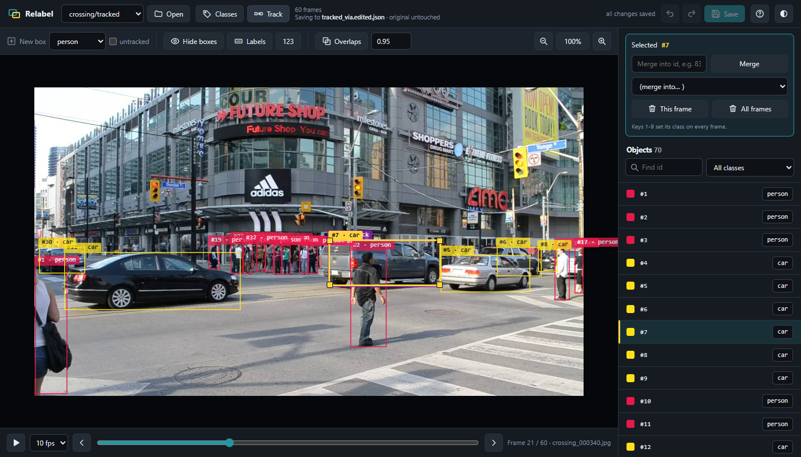
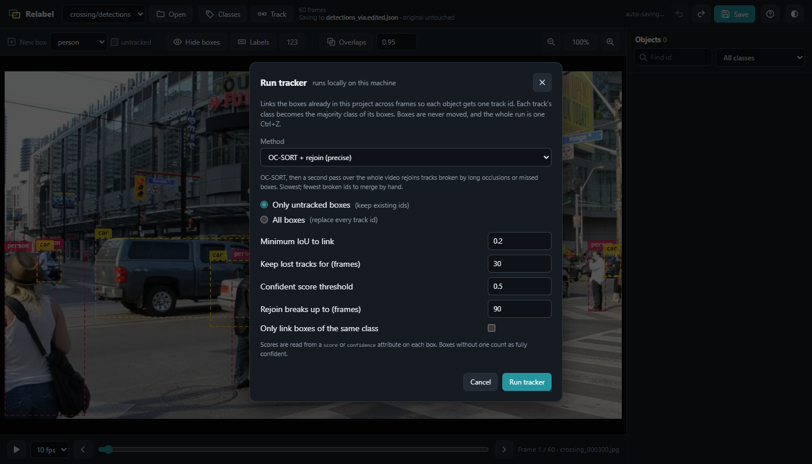

# Relabel

A local web tool for reviewing and correcting **tracked bounding-box annotations** on video frames.

Labels in video are per object, not per frame. Relabel stores the class on the **track**, so changing
one object's class fixes it on every frame it appears in. It can also link untracked boxes into
tracks with a built-in **ByteTrack** tracker that runs on your machine.



## Why

Labeling continuous frames from a video is repetitive. The same car appears in hundreds of
consecutive images, so when one of its boxes is wrong (the wrong class, or two ids for one
object), a frame-by-frame tool such as VIA makes you open every image and fix the same label again
by hand. Mistakes also slip in, because one missed frame leaves the object labelled inconsistently.

Relabel treats the object, not the frame, as the unit of work. Each box carries a track id that
links it to the same object in the other frames. When you change a class, merge two ids, or delete
an object, the change is applied to that object on **every** frame at once. Correcting a
300-frame track takes one keystroke instead of 300 edits.

This relies on the track ids being consistent: one physical object, one id across the frames.
If your boxes have no ids, or the ids are unreliable, Relabel links them with **ByteTrack**, a
multi-object tracker that follows each box from frame to frame using motion prediction and box
overlap. The better the tracks, the more a single edit fixes. Where the tracker does split one
object into two ids (for example after a long occlusion), select one and **Merge** it into the
other, and from then on it behaves as a single object.

## Features

- **Your own classes.** The class list comes from the project file and anything already used in it.
  You can add, rename, merge, reorder or delete classes in the app, or pass them with `--classes`.
- **Class per track.** Change an object's class once (click its label, or press <kbd>1</kbd>-<kbd>9</kbd>)
  and every frame of that track updates.
- **Tracking built in.** Link raw detections, or boxes you drew yourself, into tracks with ByteTrack.
  Each track gets the majority class of its boxes, which also cleans up class flicker between frames.
- **Fix track ids.** Merge two ids into one, or delete an object on one frame or on all frames.
- **Annotate like VIA.** Drag on the image to draw a box, click to select, drag to move, pull a corner
  to resize. Copy a box and paste it onto frames where it is missing: it keeps its track id.
- **Keyboard first.** Step, jump and play through frames, cycle boxes, nudge, copy/paste, set classes
  and open every tool from the keyboard (see below, or press <kbd>?</kbd> in the app).
- **Non-destructive.** Edits save automatically to `<name>.edited.json` next to the original. The
  original file is never written, and everything can be undone.
- **Review tools.** Compare two versions of a project side by side and step through the frames that
  differ. Find frames where boxes overlap heavily. Filter objects by class or id.
- **Light install.** The app is plain Python standard library plus a single-page web UI. The tracker
  additionally needs `numpy`, and uses `scipy` when it is installed.

## Quick start

Requires Python 3.8 or newer. Clone the repository, then run the launcher for your system:

```bash
git clone https://github.com/amankprajapati/relabel.git
cd relabel
./run.sh --demo                 # Linux / macOS / Git Bash
run.bat --demo                  # Windows (or double-click run.bat)
```

The first run creates a local `.venv` and installs the tracker's dependencies (`numpy`, `scipy`).
Every later run finds them already installed, skips the download and starts straight away.
`--demo` generates two small demo projects (once) and opens them in your browser:

- **tracked**: objects that already have track ids. Try changing classes, merging ids and editing boxes.
- **detections**: raw detector-style boxes with scores but no ids. Press **Track** to link them.

To open your own data, pass its folder, plus any of the options below:

```bash
./run.sh path/to/project --classes car,person,bicycle
```

Or start with no folder (`./run.sh`) and pick a JSON and a frames folder in the **Open** dialog.
Without the launchers: `pip install -r requirements.txt`, then `python -m relabel_gui_app FOLDER`.

## Command line

```
python -m relabel_gui_app [FOLDER] [--port 8001] [--host 127.0.0.1]
                          [--classes CLASSES] [--compare ORIGINAL.json] [--no-browser]
```

| Option | Meaning |
| --- | --- |
| `FOLDER` | A project folder (`*_via.json` + `frames/` or `images/`), or a parent folder containing several. |
| `--classes` | Extra classes to offer: `car,person,bicycle`, or a text file with one class per line. |
| `--compare` | A second JSON (the original) to diff the project against on startup. |
| `--port`, `--host` | Where to serve the app. The default only listens on this machine. |
| `--no-browser` | Don't open a browser tab automatically. |

## Data format

Projects are [VIA](https://www.robots.ox.ac.uk/~vgg/software/via/) JSON files with rectangle regions.
Relabel reads and writes these region attributes:

| Attribute | Use |
| --- | --- |
| `class` | The object's class. |
| `track_id` | Links boxes of the same object across frames. Boxes without one are shown dashed as *untracked*. |
| `score` or `confidence` | Optional detector confidence, used by the tracker. |

Any other attributes on a region are kept as they are. The class list is read from and saved to
`_via_attributes.region.class.options`. Frames play in natural filename order.

## The tracker

`Track` sends the boxes to the local server, which links them with a ByteTrack-style tracker
(`relabel_gui_app/tracker.py`):

1. A constant-velocity Kalman filter predicts where each track's box will be in the next frame.
2. Confident boxes are matched to live and recently lost tracks by IoU.
3. Weaker boxes are then matched, with a stricter IoU gate, to tracks still unmatched. This keeps a
   track alive through partial occlusion instead of dropping it.
4. Leftover boxes start new tracks. Tracks unseen for *N* frames end.

It differs from the original ByteTrack on purpose, because every box here is an annotation to keep
rather than a detection that may be wrong. Tracks start on their first box, and every box receives
an id. In a folder holding several videos, frames are grouped by filename with the frame number
removed, and tracking restarts for each video.

In the dialog you choose whether to track only untracked boxes (existing ids are kept) or to
re-track everything. You can also set the IoU needed to link boxes, how long a lost track is
remembered, the confident-score threshold, and whether links must stay within one class.
The whole run is a single undo step.



## Keyboard

Mouse: drag on an empty part of the image to draw a box (<kbd>Ctrl</kbd>+drag to start on top of
another box), click a box to select it, drag it to move, drag a corner to resize, double-click to
reach a box behind another, scroll to zoom.

| Key | Action |
| --- | --- |
| <kbd>←</kbd> <kbd>→</kbd> or <kbd>P</kbd> <kbd>N</kbd> | Previous / next frame |
| <kbd>Home</kbd> <kbd>End</kbd> | First / last frame |
| <kbd>PgUp</kbd> <kbd>PgDn</kbd> | Back / forward 10 frames |
| <kbd>Space</kbd> | Play / pause |
| <kbd>Tab</kbd> / <kbd>Shift</kbd>+<kbd>Tab</kbd> | Select the next / previous box on this frame |
| <kbd>1</kbd>-<kbd>9</kbd> | Set the selected object's class on every frame (nothing selected: the class for new boxes) |
| <kbd>Ctrl</kbd>+<kbd>C</kbd> / <kbd>Ctrl</kbd>+<kbd>V</kbd> | Copy the selected box / paste it on this frame with the same track id |
| <kbd>Ctrl</kbd>+arrows | Nudge the selected box 1 px (<kbd>Shift</kbd> for 10 px) |
| <kbd>Del</kbd> / <kbd>Shift</kbd>+<kbd>Del</kbd> | Delete the selected box on this frame / on every frame |
| <kbd>L</kbd> / <kbd>H</kbd> | Hide labels / hide boxes on this frame |
| <kbd>+</kbd> <kbd>-</kbd> <kbd>0</kbd> | Zoom in / out / reset |
| <kbd>C</kbd> / <kbd>T</kbd> | Classes dialog / tracker |
| <kbd>Ctrl</kbd>+<kbd>S</kbd> | Save now |
| <kbd>Ctrl</kbd>+<kbd>Z</kbd> / <kbd>Ctrl</kbd>+<kbd>Y</kbd> | Undo / redo |
| <kbd>Esc</kbd> | Deselect, stop playback or close a dialog |
| <kbd>?</kbd> | Help |

## Code layout

```
relabel_gui_app/
  app.py         entry point: arguments, project discovery, server start, browser open
  server.py      HTTP routes (standard library http.server)
  clip.py        project model: load a VIA file, serve frames and boxes, save to .edited.json
  classdefs.py   where the class list comes from (project file, used classes, --classes)
  tracker.py     ByteTrack-style tracker (numpy)
  compare.py     two-file compare: load the "before" file and check the pair is compatible
  fsbrowse.py    directory browser for the Open dialog (handles Windows drives)
  render.py      builds the page from web/ and fills in the placeholders
  utils.py       natural sort
  web/           index.html, style.css, app.js: the whole user interface
make_sample.py   synthetic demo projects
run.sh, run.bat  set up .venv on first run (skipped afterwards) and launch
requirements.txt numpy + scipy, used only by the tracker
tests/           tracker tests:  python -m unittest discover tests
```

The browser holds the working state and sends only changed frames when it saves. The server never
modifies the original JSON.
